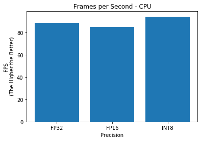

# Computer Pointer Controller

The objective of this project is to use a gaze detection model to control the mouse pointer of the computer. The [Gaze Estimation](https://docs.openvinotoolkit.org/latest/_models_intel_gaze_estimation_adas_0002_description_gaze_estimation_adas_0002.html) model is utilized to estimate the gaze of the user's eyes and change the mouse pointer position accordingly. The core of this project is to run multiple models in the same machine and coordinate the flow of data between those models.

The gaze estimation model requires three inputs:
* The head pose
* The left eye image
* The right eye image.  

These inputs can be obtained from three other OpenVino models:

* [Face Detection](https://docs.openvinotoolkit.org/latest/_models_intel_face_detection_adas_binary_0001_description_face_detection_adas_binary_0001.html)
* [Head Pose Estimation](https://docs.openvinotoolkit.org/latest/_models_intel_head_pose_estimation_adas_0001_description_head_pose_estimation_adas_0001.html)
* [Facial Landmarks Detection](https://docs.openvinotoolkit.org/latest/_models_intel_landmarks_regression_retail_0009_description_landmarks_regression_retail_0009.html)

The flow of the pipeline will look like this:


## Project Set Up and Installation
1. Install [OpenVINO](https://docs.openvinotoolkit.org/latest/_docs_install_guides_installing_openvino_linux.html) toolkit.
2. Set the Environment Variables
```sh
source /opt/intel/openvino/bin/setupvars.sh
```
3. Switch to `Model Downloader` folder and download the models:
```sh
cd /opt/intel/openvino/deployment_tools/tools/model_downloader
sudo ./downloader.py --name face-detection-adas-binary-0001 -o <your_directory>/Computer-Pointer-Controller/models/
sudo ./downloader.py --name head-pose-estimation-adas-0001 -o <your_directory>/Computer-Pointer-Controller/models/
sudo ./downloader.py --name landmarks-regression-retail-0009 -o <your_directory>/Computer-Pointer-Controller/models/
sudo ./downloader.py --name gaze-estimation-adas-0002 -o <your_directory>/Computer-Pointer-Controller/models/
```
4.Run command `python3 main.py -h` to get the main application supported arguments

### Project Directory structure
* `README.md` - Writeup of this projection  
* `images/` - images used in this writeup
* `requirements.txt` - Dependencies of this project
* `src/`  
  * `face_detection.py` - Face detection inference implementation  
  * `facial_landmarks_detection.py` - Facial landmarks detection inference implementation  
  * `gaze_estimation.py` - Gaze estimation inference implementation  
  * `head_pose_estimation.py` - Head pose estimation inference implementation  
  * `main.py` - Main script to run the application
  * `mouse_controller.py` - Class to control the mouse pointer using `pyautogui` library
  * `Access_Performance.ipynb` -  The notebook to plot the benchmark performance
* `bin/`- Folder that contain input and output videos and the stats files. The output files are organized according to device type and precision level.

## Demo
The `main.py` has the following arguments:

```
usage: main.py [-h] [-p PRECISION] -i INPUT [-l CPU_EXTENSION] [-d DEVICE]
               [-t THRESHOLD] [-o OUTPUT_DIR] [-di DISPLAY_INTERMEDIATE]

optional arguments:
  -h, --help            show this help message and exit
  -p PRECISION, --precision PRECISION
                        Precision of models(FP32, FP16 or INT8).Each model in
                        the pipeline will be used with this precision if
                        available. Default: FP16
  -i INPUT, --input INPUT
                        Path to video file or image or 'cam' for capturing
                        video stream from camera
  -l CPU_EXTENSION, --cpu_extension CPU_EXTENSION
                        MKLDNN (CPU)-targeted custom layers. Absolute path to
                        a shared library with the kernels impl.
  -d DEVICE, --device DEVICE
                        Specify the target device to infer on; `CPU`, `GPU`, `FPGA`
                        or `MYRIAD` is acceptable.
  -t THRESHOLD, --threshold THRESHOLD
                        Probability threshold for detections filtering
  -o OUTPUT_DIR, --output_dir OUTPUT_DIR
                        Path to output directory
  -di DISPLAY_INTERMEDIATE, --display_intermediate DISPLAY_INTERMEDIATE
                        Select between 'yes' | 'no' to display intermediate
                        output
```

Example of the command :
```sh
python3 main.py -p "FP16", -i '../bin/demo.mp4' -t 0.5 -o '../bin/'
```  
This will run the application using `FP16` precision models, video input file `demo.mp4`, with threshold of 0.5 and save the output video and stats files in `/bin` folder.  

Example of the output video:
[](http://www.youtube.com/watch?v=Sk1Fx272dw8 "Computer Pointer Controller - FP_16")

## Benchmarks
The application was run on my local computer with Intel® Core™ i9-9900K CPU, Ubuntu 18.04 on VMware. 4 cores were assigned to the Ubuntu virtual machine. The tests were run on different types of quantization model where applicable (*For [Face Detection](https://docs.openvinotoolkit.org/latest/_models_intel_face_detection_adas_binary_0001_description_face_detection_adas_binary_0001.html) model, only precision FP32 is avalaible*).





## Results
From the above plots, there is no significant difference of the performance of the the quantization models. `INT8` models achieve the lowest total inference time and highest FPS but with slightly longer loading time. From observation, there is also no significant decrease in the accuracy while running the application with low precision models.

## Suggestion for Improvement
* Try to implement async inference for parallel processing. If you look at the model flowchart, the landmark detection and head pose estimation models should run in parallel. However, program flow sequentially which make inference slower. You should run asynchronous inference on both models back to back and then poll for their results.
* There are a lot of repetition in the code especially in the models file. A better way is to create a base class with basic functions and then create other models based on that and override functions if necessary. For example:   
```python
class Model:
    def __init__(self):
        self.plugin = None
        self.network = None
        self.input_blob = None
        self.output_blob = None
        self.exec_network = None
        self.infer_request = None
    def load_model(self, model, device="CPU", cpu_extension=None):
        ....
```
```python
def FaceModel(Model):
    def __init__(self):
        Model.__init__(self) # initialize the base class
        # then create/override the variable
        self.model_name = "Face"

    # Don't need to create load_model() if it is the same as base model
```
